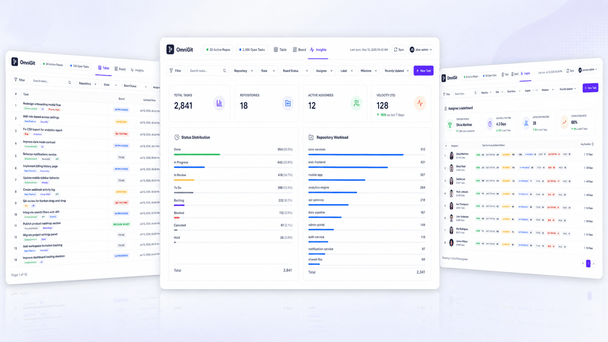

# OmniGit



OmniGit is a unified, locally-hosted, lightning-fast Kanban dashboard and task management interface designed to seamlessly aggregate issues and pull requests across multiple GitHub repositories. Built with a focus on speed, privacy, and a pristine flat-UI aesthetic.

## 🚀 Features

- **Multi-Repository Aggregation**: View and manage tasks from your personal repositories, repositories where you collaborate, and organization repositories all in one place.
- **Dual Views**: Seamlessly switch between a high-density Table View and an interactive Kanban Board View.
- **Local-First Privacy**: Your GitHub Personal Access Token (PAT) and all synced repository data are stored strictly in a local SQLite database. No data is ever sent to a third-party server.
- **Task Creation**: Create new issues directly from the OmniGit sidebar, which instantly pushes them to GitHub and updates your local board.
- **Advanced Filtering**: Filter your tasks by Title, Assignee, State (Open/Closed), Labels, or Status.
- **Lightning Fast**: Powered by Next.js Server Components, Prisma, and SQLite, providing near-instant load times and zero API rate-limiting delays during general usage.
- **Premium Flat UI**: Custom-built with Tailwind CSS to provide a clean, spreadsheet-like aesthetic with meticulously removed drop-shadows for a sleek, professional look.

## 🛠 Tech Stack

- **Framework**: [Next.js 15](https://nextjs.org/) (App Router)
- **Styling**: [Tailwind CSS](https://tailwindcss.com/)
- **Database**: SQLite
- **ORM**: [Prisma](https://www.prisma.io/)
- **Icons**: [Lucide React](https://lucide.dev/)
- **Markdown Parsing**: `react-markdown`

## 📦 Getting Started

### Prerequisites

- Node.js (v20 or higher)
- **pnpm** (via corepack: `corepack enable pnpm`)

### Installation

1. **Clone the repository** (if you haven't already):
   ```bash
   git clone <your-repo-url>
   cd OmniGit
   ```

2. **Install dependencies**:
   ```bash
   pnpm install
   ```
   *(Note: This project strictly requires `pnpm` v9. Corepack will automatically detect and use the correct version defined in `package.json`).*

3. **Set up the Database**:
   OmniGit uses Prisma with a local SQLite database. Push the schema to create your local `.db` file:
   ```bash
   pnpm db:push
   ```

4. **Start the Development Server**:
   ```bash
   pnpm dev
   ```

5. **Open the Application**:
   Navigate to [http://localhost:7492](http://localhost:7492) in your browser.

## 🖥 Desktop Mode & Packaging

OmniGit includes built-in scripts to run as an offline desktop application (via Chrome App Mode) and to package it for distribution.

### Running as a Desktop App
You can instantly launch OmniGit in a dedicated, chromeless window without manually starting the server.
- **Mac/Linux**: Run `pnpm desktop` or double-click the `start_app.command` file in Finder.
- **Windows**: Run `pnpm desktop:win` or double-click the `start_app.bat` file.

### Distributing the App to Users
OmniGit is configured to use Next.js `standalone` output mode. You can package the entire application into a single `.zip` file that anyone can run locally (as long as they have Node.js installed).

To generate the release build:
```bash
pnpm release
```
This will create a `OmniGit-Release.zip` file containing a highly-optimized, production-ready version of the app and a `start.command` script for the end-user.

## 🔑 Connecting to GitHub

1. Generate a **Classic Personal Access Token (PAT)** on GitHub.
2. Grant the token the **`repo`** scope (this provides access to private repositories, issues, and PRs).
   - *Note: If your organization uses Single Sign-On (SSO), ensure you click "Configure SSO" next to the token to authorize it for organization access.*
3. Open OmniGit and enter your token into the onboarding prompt.
4. Click **Fetch Repos** in the Settings drawer, toggle the repositories you want to track, and click **Sync**.

## 🗑 Legacy Flask Version

This repository was originally built using Python and Flask. For historical reference, the entire legacy Python codebase, including its virtual environment and original `.git` history, has been archived in the `legacy_flask/` directory. The root directory is now exclusively dedicated to the modern Next.js application.

## 📄 License

This project is open-source and available for personal or enterprise use.
